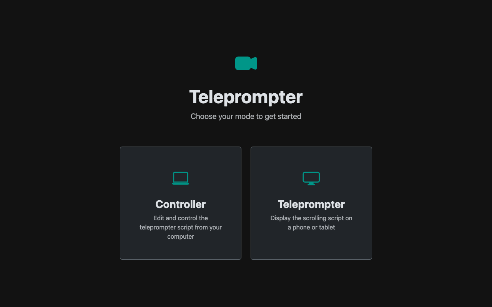
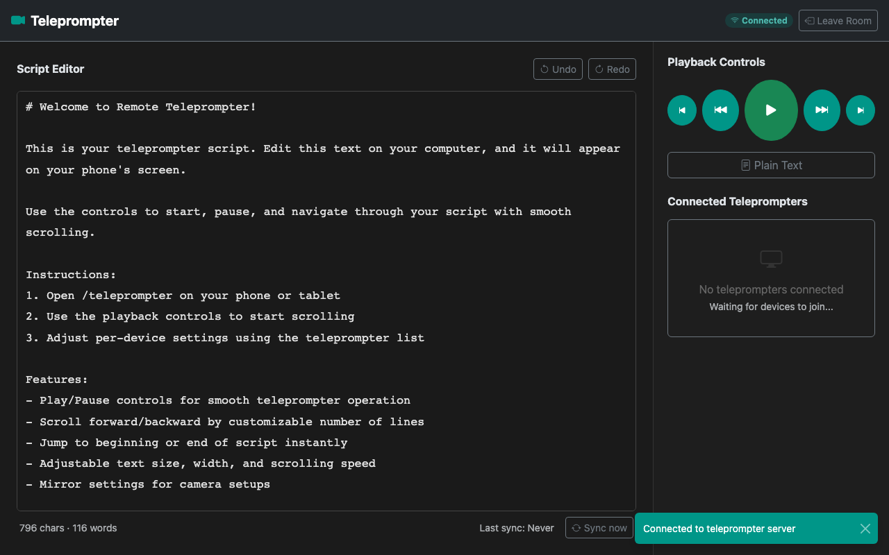
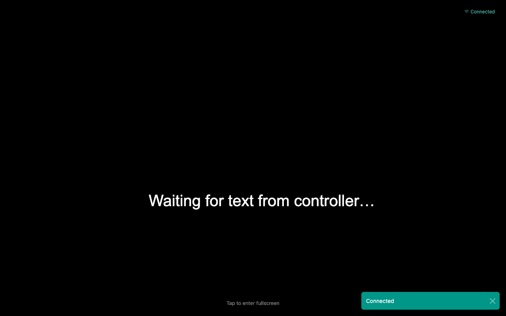

# Remote Teleprompter

A **multi-device** teleprompter application that enables real-time teleprompter control between devices. One device (computer) acts as a controller to edit scripts and manage playback, while one or more other devices (phones/tablets) display the teleprompter text.

This project was made to facilitate recording videos for my YouTube channel where I use my phone on a basic teleprompter in front of my camera and need to control it from my computer running OBS. With this project I can simply navigate to a URL on my phone and manage everything from my computer without touching the phone again until I'm done.

Multiple teleprompter clients are supported to account for multi-camera setups with multiple teleprompters.

## 📸 Screenshots

<table>
  <tr>
    <td align="center"><b>Landing Page</b></td>
    <td align="center"><b>Controller Mode</b></td>
    <td align="center"><b>Teleprompter Mode</b></td>
  </tr>
  <tr>
    <td></td>
    <td></td>
    <td></td>
  </tr>
  <tr>
    <td align="center">Select your role to get started</td>
    <td align="center">Edit scripts and control playback</td>
    <td align="center">Display the scrolling text</td>
  </tr>
</table>

## 🎯 Requirements

- Docker
- Docker Compose

## 🚀 Deployment

The application ships as a single container. Copy [`compose.yaml`](./compose.yaml) and run:

```sh
docker compose up -d
```

The app will be available at **http://localhost:8080**.

## ⚙️ Configuration

| Environment Variable | Description       | Default |
| -------------------- | ----------------- | ------- |
| `PORT`               | HTTP listen port  | `8080`  |

## 📝 License

This code has been mostly AI generated and used as a playground/testbed. My manual intervention has been minimal, mostly doing cleanup. Thus, I take no "ownership" over this code. Feel free to do whatever. As the [LICENSE](./LICENSE) states: "This is free and unencumbered software released into the public domain".
