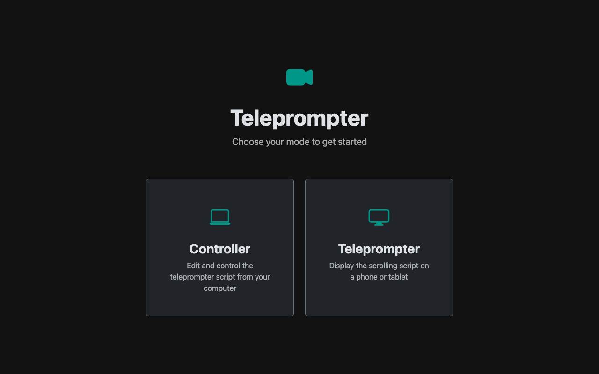
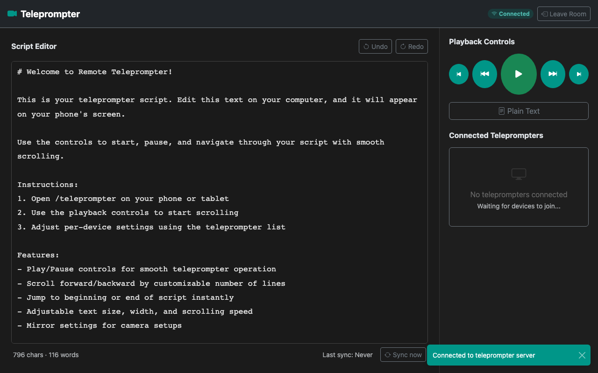
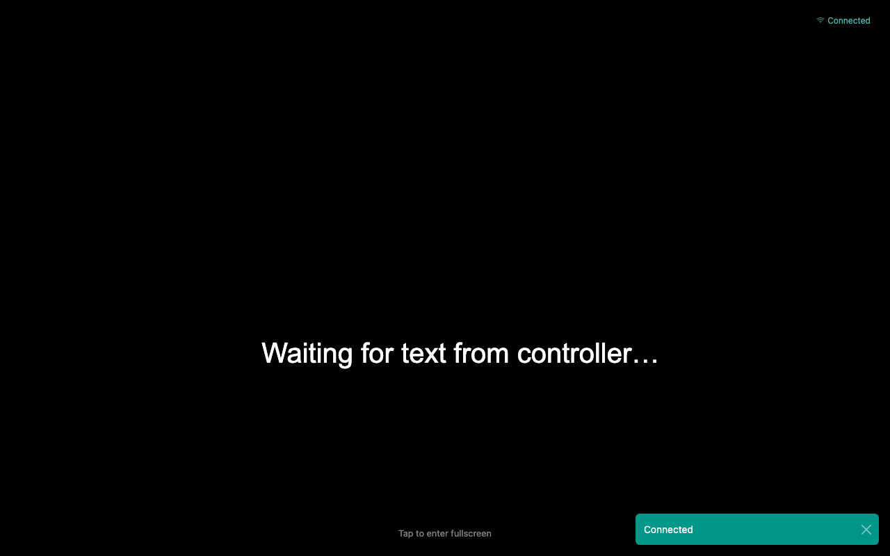

# Remote Teleprompter

A **multi-device** teleprompter application that enables real-time teleprompter control between devices. One device (computer) acts as a controller to edit scripts and manage playback, while one or more other devices (phones/tablets) display the teleprompter text.

This project was made to facilitate recording videos for my YouTube channel where I use my phone on a basic teleprompter in front of my camera and need to control it from my computer running OBS. With this project I can simply navigate to a URL on my phone and manage everything from my computer without touching the phone again until I'm done.

Multiple teleprompter clients are supported to account for multi-camera setups with multiple teleprompters.

> [!WARNING]
> **AI Slop / Vibe Coded Project** — This is project is "AI Slop". This is something that was "built" in a weekend with heavy AI assistance to scratch a personal itch. The code works for my use case, but it has not been hardened, audited, or battle-tested. Deploy at your own risk, preferably not exposed to the open internet. No warranties, no support guarantees, no promises.

## 📸 Screenshots

<table>
  <tr>
    <td align="center"><b>Landing Page</b></td>
    <td align="center"><b>Controller Mode</b></td>
    <td align="center"><b>Teleprompter Mode</b></td>
  </tr>
  <tr>
    <td></td>
    <td></td>
    <td></td>
  </tr>
  <tr>
    <td align="center">Select your role to get started</td>
    <td align="center">Edit scripts and control playback</td>
    <td align="center">Display the scrolling text</td>
  </tr>
</table>

## 🎯 Requirements

- Docker
- Docker Compose

## 🚀 Deployment

The application ships as a single container. Copy [`compose.yaml`](./compose.yaml) and run:

```sh
docker compose up -d
```

The app will be available at **http://localhost:8080**.

## ⚙️ Configuration

| Environment Variable | Description                                                            | Default                |
| -------------------- | ---------------------------------------------------------------------- | ---------------------- |
| `PORT`               | HTTP listen port                                                       | `8080`                 |
| `OIDC_ISSUER_URL`    | OIDC issuer URL (e.g. `https://keycloak.example.com/realms/myrealm`). Setting this enables multi-user mode. | _(unset — single-user mode)_ |
| `OIDC_CLIENT_ID`     | OIDC client ID (required when `OIDC_ISSUER_URL` is set)                | —                      |
| `OIDC_CLIENT_SECRET` | OIDC client secret                                                     | —                      |
| `OIDC_REDIRECT_URL`  | Absolute callback URL, e.g. `https://tp.example.com/auth/callback` (required when `OIDC_ISSUER_URL` is set) | —                      |
| `OIDC_SCOPES`        | Space-separated scopes to request                                      | `openid profile email` |
| `TOKENS_FILE`        | Path to persist Personal Access Tokens as JSON (multi-user mode only). Setting this makes tokens survive restarts — mount a volume to this path. | _(unset — tokens are in-memory only)_ |

## 🔐 Authentication (optional)

By default there is **no authentication and no user separation**: everyone who opens the app shares the same script and playback state (single-user mode), exactly as before.

Setting the `OIDC_*` environment variables switches the app into **multi-user mode**, authenticating against any OIDC provider (e.g. Keycloak) via the authorization code flow with PKCE. There is no local/password auth — OIDC is the only login method.

In multi-user mode:

- Every user gets their **own session** (one per user, created on first visit) at `/session/<id>`, with its own script, teleprompters, and playback state.
- Other users navigating to your session URL get a **404** — sessions are private by default.
- The session owner can **invite** other users by email from the controller sidebar ("Session Members"). Once invited, a user can open the session link (which the owner shares with them) and join as a controller or teleprompter. Access can be revoked the same way.
- All state (sessions, memberships, logins) is in-memory and resets when the container restarts.

Example Keycloak setup: create a confidential OpenID Connect client with `Standard flow` enabled and `https://<your-host>/auth/callback` as a valid redirect URI, then run:

```sh
OIDC_ISSUER_URL=https://keycloak.example.com/realms/myrealm
OIDC_CLIENT_ID=teleprompter
OIDC_CLIENT_SECRET=<client secret>
OIDC_REDIRECT_URL=https://tp.example.com/auth/callback
```

### 🔑 Personal Access Tokens (for Stream Deck, scripts, etc.)

Tools like a Stream Deck can send HTTP requests but can't complete the OIDC browser login, so in multi-user mode you can generate a **Personal Access Token** from the **Account** page (linked from the landing page once logged in) and use it instead of a cookie session.

Send it as a bearer token on any API request:

```sh
curl -X POST https://tp.example.com/api/playback/start \
  -H "Authorization: Bearer tp_pat_<token>"
```

The `/api/playback/...` routes always target *your own* session (created on first use, same one `/` redirects you into), so the URL never changes across restarts or logins — no session ID to look up or update in your Stream Deck config. If you need to control a session you don't own but were invited to, use the session-scoped form instead: `/session/<session-id>/api/playback/start`.

A token is tied to your account and can do anything your logged-in session can do — treat it like a password, and revoke it from the Account page if it leaks. Tokens are in-memory by default (lost on restart, same as everything else); set `TOKENS_FILE` and mount a volume to that path if you want them to persist.

## 📝 License

This code has been mostly AI generated and used as a playground/testbed. My manual intervention has been minimal, mostly doing cleanup. Thus, I take no "ownership" over this code. Feel free to do whatever. As the [LICENSE](./LICENSE) states: "This is free and unencumbered software released into the public domain".
