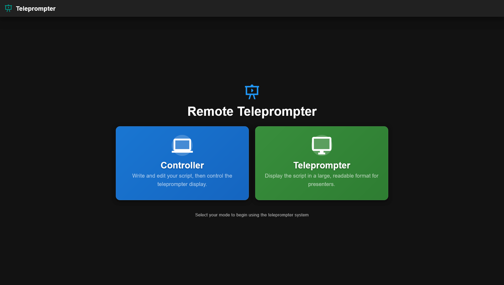
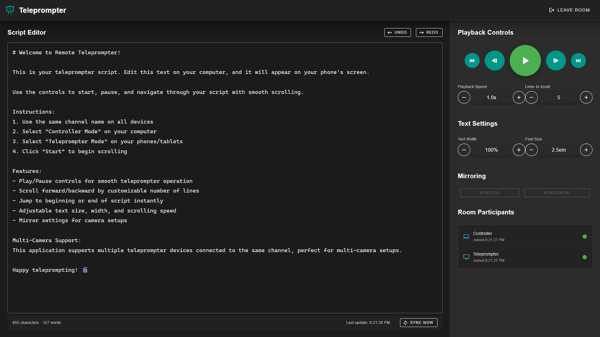

# Remote Teleprompter

A **multi-device** teleprompter application that enables real-time teleprompter control between devices. One device (computer) acts as a controller to edit scripts and manage playback, while one or more other devices (phones/tablets) display the teleprompter text.

This project has been made to facilitate recording videos for my YouTube channel where I am using my phone on a basic teleprompter in front of my camera and I need to control it from my computer which is recording everything via OBS. With this project, I can simply navigate to a URL on my phone and place it on the prompter and then manage everything from my computer, not having to touch the phone anymore until I'm done.

Multiple teleprompter clients are also supported to account for situations like multi-camera setups with multiple teleprompters.

## 📸 Screenshots

<table>
  <tr>
    <td align="center"><b>Landing Page</b></td>
    <td align="center"><b>Controller Mode</b></td>
    <td align="center"><b>Teleprompter Mode</b></td>
  </tr>
  <tr>
    <td></td>
    <td></td>
    <td></td>
  </tr>
  <tr>
    <td align="center">Select your role to get started</td>
    <td align="center">Edit scripts and control playback</td>
    <td align="center">Display the scrolling text</td>
  </tr>
</table>

## 🎯 Requirements

- Docker
- Docker Compose

## 🚀 Deployment Options

This project provides an example Docker Compose configuration via [`compose.yaml`](./compose.yaml). It will spin up:

- a container for the frontend application, using the `ghcr.io/mirceanton/teleprompter-frontend:latest` image
- a container for the backend application, using the `ghcr.io/mirceanton/teleprompter-backend:latest` image
- a container for a Redis, using the `docker.io/redis` image

> [!NOTE]
> **About Redis:**
>
> Redis is used to synchronize state across multiple backend instances when running in a scaled/load-balanced environment (e.g., Kubernetes deployments with multiple replicas). If you're running a single backend instance (e.g. most if not all docker compose scenarios), Redis is **optional** and can be removed. To run without Redis, simply delete the `redis` service section and remove the `depends_on` and `environment` sections from the backend service in `compose.yaml`.

If you prefer to build the images locally instead of using the prebuilt ones, you can apply the `-f compose.dev.yaml` overlay to your command.

## ⚙️ Configuration Options

### Configuring the Frontend

The frontend is a basic static site built using VueJS and then served via an NGINX container. Thus, it can't really take in environment variables to customize, for example, the URL at which the API is located. Thus, it loads the configuration at runtime via a `config.json` file.

This file is located at `/usr/share/nginx/html/config.json`. Its main purpose right now is to point the frontend to the right URL for the backend API. Since this is a static site served by NGINX, this means that the code runs in your browser, not on the server. This is important because it essentially means `localhost` ain't cutting it. You need to provide the actual hostname and port at which the backend is running. For example:

```jsonc
{
  // this is where the backend is found
  "backendUrl": "http://192.168.1.2:8001"
}
```

### Configuring the Backend

| Environment Variable | Description                                                           | Required | Default Value |
| -------------------- | --------------------------------------------------------------------- | :------: | ------------- |
| `REDIS_HOST`         | Hostname or IP address of the Redis server                            |    No    | `redis`       |
| `REDIS_PORT`         | Port number on which Redis is listening                               |    No    | `6379`        |
| `REDIS_PASSWORD`     | Password for authenticating with Redis (if authentication is enabled) |    No    | N/A           |
| `REDIS_DB`           | Redis database number to use (0-15)                                   |    No    | `0`           |

## 📝 License

This code has been mostly AI generated and used as a playground/testbed for GitHub copilot. My manual intervention in here has been more or less minimal, mostly doing cleanup here and there. Thus, I take no "ownership" over this code. I did not write it, it is not "mine". Feel free to do whatever. As the [LICENSE](./LICENSE) states: "This is free and unencumbered software released into the public domain".
